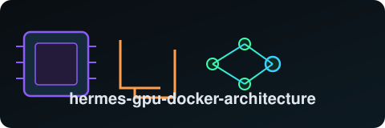

  

  
  
  
  
  
  
  
  

# hermes-gpu-docker-architecture

A current-state architecture writeup of a real, working dual-GPU local-LLM stack: [Hermes
Agent](https://github.com/NousResearch/hermes-agent) driving a local [Ollama](https://ollama.com)
daemon across two consumer NVIDIA GPUs, a Docker-sandboxed terminal tool with optional GPU
passthrough, a layered systemd config that took several rounds of real debugging to get right, and
an `mem0` memory pipeline running alongside whatever chat model is active. Every diagram and every
number in this repo is sourced from a real, live system — actual `journalctl` output, actual
`nvidia-smi`/`ollama ps` readings, actual launched `llama-server` command lines — not vendor
documentation or theoretical estimates.

**This repo does not re-tell the incident.** A previous public writeup,
[**hermes-agent-blast-radius**](https://github.com/danindiana/hermes-agent-blast-radius),
documents in detail how an earlier version of this same Hermes Agent instance auto-approved its
own `rm -rf` and destroyed unrelated prior work, the root cause in its approval-logic code path,
and the Docker-sandbox containment fix that followed — including the addenda on installing system
packages inside the sandbox and production-testing the `approvals.deny`/`checkpoints` hardening.
Read that repo for the story. This repo picks up from the result: **how the system is actually
built and configured today**, plus everything learned since (GPU passthrough into that same
sandbox, KV-cache quantization, multi-GPU topology, the derived-Modelfile-tag pattern, and a
three-layer context-window footgun that's easy to fall into with any local-Ollama agent setup).

## Hardware

| Component | Spec |
|---|---|
| Motherboard | ASUS ROG STRIX B650-A GAMING WIFI (AM5 socket) |
| CPU | AMD Ryzen 9 7950X3D, 16C/32T |
| RAM | 192 GB DDR5 (4×48GB) |
| GPU 0 | NVIDIA RTX 4080 SUPER — 16 GB VRAM |
| GPU 1 | NVIDIA RTX 5070 — 12 GB VRAM |
| Combined VRAM | ~28 GB |
| GPU interconnect | `PHB` (both through the CPU's PCIe root — no NVLink) |

## The diagrams

All 15 diagrams live in [`diagrams/`](diagrams/) as Graphviz `.dot` sources, each rendered to both
`.svg` and `.png` (dark-background, neon-accent style — full color legend in each diagram's own
subgraph labels). Click any title below to open the SVG.

### System shape

1. **[System overview](diagrams/01_system_overview.svg)** — the whole stack in one picture: Hermes
   host process, the Ollama daemon and its two GPUs, the mem0 pipeline, and the Docker sandbox as a
   separate, parallel isolated path.
2. **[Hermes → Ollama model path](diagrams/02_hermes_ollama_model_path.svg)** — the actual request
   flow from `~/.hermes/config.yaml`'s `model.provider: custom` / `model.base_url` through to a
   loaded `llama-server` runner, including where a config mismatch gets silently dropped.
3. **[Docker sandbox isolation](diagrams/03_docker_sandbox_isolation.svg)** — condensed view of the
   `CapDrop=ALL`, non-root, scoped-mount sandbox (`terminal.backend: docker`). Full incident
   narrative is in `hermes-agent-blast-radius`, linked from the diagram itself.
4. **[GPU passthrough](diagrams/04_gpu_passthrough.svg)** — before/after of adding `--gpus=all` to
   the sandbox's `docker_extra_args`: the NVIDIA Container Toolkit auto-injects driver libraries
   and CLI tools (`nvidia-smi`) into the container at `docker run` time — no image rebuild needed,
   confirmed already installed on the host (`nvidia-container-toolkit` 1.20.0-1).
5. **[Multi-GPU topology](diagrams/05_multi_gpu_topology.svg)** — the real `PHB`-only interconnect
   (no NVLink, confirmed via `nvidia-smi topo -m`) contrasted with Ollama's default **layer-split
   (pipeline) parallelism**, which moves only ~16KB of hidden state per token between GPUs — making
   the NVLink absence a non-issue for how this box actually runs models. Tensor/row-split mode
   would perform worse here, but Ollama doesn't use it by default.

### The config layer

6. **[Ollama systemd config layers](diagrams/06_ollama_systemd_config_layers.svg)** — every
   environment variable in `/etc/systemd/system/ollama.service.d/override.conf`, grouped by
   concern (networking, GPU/concurrency, attention/KV cache, resource management, context
   ceiling), each annotated with *why* it's set to that value.
7. **[The 3-layer context-window footgun](diagrams/07_context_window_three_layer_footgun.svg)** —
   `model.context_length` in Hermes's own config, `model.default` needing to match the actually
   -running model (or Hermes silently ignores the context setting), and the systemd
   `OLLAMA_CONTEXT_LENGTH` hard ceiling that clamps everything regardless. Get any one of the three
   wrong and you get silent truncation, not an error. Also documents a related finding: the
   `custom` (local Ollama) provider profile never sends `max_tokens` to Ollama at all —
   `num_ctx`/context length is the *only* output-length lever for this provider.
8. **[KV-cache quantization mechanics](diagrams/08_kv_cache_quantization_mechanics.svg)** — real
   measured buffer sizes from this session's live test load of `devstral-small-2:24b` at its full
   262,144-token context: **21,760 MiB total KV cache** (K: 10,880 MiB, V: 10,880 MiB, both
   `q8_0`), split 10,336 MiB CPU / 7,072 MiB GPU0 / 4,352 MiB GPU1 — versus what would have been
   ~43.5 GiB at the previous f16 default.
9. **[KV-quant architecture allowlist](diagrams/09_kv_quant_architecture_allowlist.svg)** — Ollama
   only actually applies KV-cache quantization to a specific allowlist of GGUF architectures
   (`gemma3`, `gptoss`, `mistral3`, `qwen3`/`qwen3moe`/`qwen3vl`/`qwen3vlmoe`); anything else
   **silently falls back to f16** with no warning. Three real contrast cases tested live this
   session: `devstral-small-2:24b` (`mistral3`, confirmed quantized), `mistral-nemo:12b` (`llama`
   arch, expected to silently stay f16), and `nemotron-3.5-lightning:1m` (`nemotron_h_moe`, not on
   the documented list but partially quantized anyway thanks to its hybrid design).
10. **[Weight quant vs. KV quant](diagrams/10_weight_quant_vs_kv_quant.svg)** — a conceptual
    diagram debunking a natural but wrong assumption: a `Q4_K_M`-quantized model does **not**
    automatically get a quantized KV cache. These are two fully independent settings — one baked
    into the GGUF file at build time, one set as a global Ollama-daemon environment variable at
    runtime.

### Model-specific findings

11. **[Nemotron hybrid state-space](diagrams/11_nemotron_hybrid_state_space.svg)** — the concrete
    mechanism behind `nemotron-3.5-lightning:1m`'s long-context VRAM efficiency: of its ~59 layers,
    only ~7 do real attention KV caching (6 quantized to q8_0, 1 stuck at f16); the other ~52 use a
    Mamba/SSM recurrent state that is a **fixed 142.85 MiB total regardless of context length**.
    Measured total KV+state at the model's full 1,048,576-token native context: under 4.4 GiB.
12. **[Derived-tag Modelfile pattern](diagrams/12_derived_tag_modelfile_pattern.svg)** — the
    `FROM <base>` + `PARAMETER num_ctx <n>` workflow used to give a single model tag a custom
    context window without raising the *global* context ceiling for every other model sharing the
    daemon. Two real, currently-installed examples: `nemotron-3.5-lightning:1m` (full native 1M
    context) and `devstral-small-2:24b-196k` (half of devstral's 393,216-token native context —
    currently Hermes's active `model.default`).

### Operational history

13. **[Model-loading lifecycle](diagrams/13_model_loading_lifecycle.svg)** — the root cause of a
    real eviction-thrashing incident (`OLLAMA_MAX_LOADED_MODELS=2` against a workload needing 3
    concurrent models per turn — chat model, mem0 extractor, embedder — caused 313 load/evict
    cycles in 3 hours), the fix (`MAX_LOADED_MODELS=3`, a dedicated CPU-pinned extractor tag,
    `NUM_PARALLEL` halved), and the verified zero-eviction steady state that followed.
14. **[mem0 memory pipeline](diagrams/14_mem0_memory_pipeline.svg)** — `mem0-extractor-cpu` (a
    derived, 100%-CPU-pinned tag — costs nothing on a 192GB-RAM box) and `nomic-embed-text` (GPU
    embedder) writing into an embedded Qdrant store, fully decoupled from whichever chat model is
    currently active — swapping the chat model never requires touching mem0 config.
15. **[Config evolution timeline](diagrams/15_config_evolution_timeline.svg)** — the chronological
    "how we got here" summary: context-ceiling raises, the thrashing fix, two derived-tag creations,
    the Docker-sandbox hardening, the most recent context-ceiling raise (from a real
    `finish_reason='length'` truncation bug), KV-cache quantization, and GPU passthrough — tying
    the other 14 diagrams together into one narrative arc.

## Key takeaways for anyone running a similar local-Ollama agent stack

- **KV-cache quantization is not automatic and not universal.** Setting
  `OLLAMA_KV_CACHE_TYPE=q8_0` is a global, daemon-wide setting, it requires flash attention as a
  prerequisite, and it only actually applies to an allowlisted set of model architectures — check
  the real launched command line (`journalctl` grep for `--cache-type-k`/`--cache-type-v`), don't
  assume from config alone.
- **A local-only "custom" OpenAI-compatible provider profile may have no output-token knob at
  all** — if your agent framework's "raise the output limit" setting appears to do nothing against
  local Ollama, check whether context length is actually the only lever your framework forwards.
- **Multi-GPU without NVLink is fine for the common case.** Layer-split (pipeline) parallelism,
  which is what most local-inference stacks default to, needs almost no inter-GPU bandwidth — don't
  assume you need NVLink-class interconnect just because you have two GPUs.
- **Hybrid state-space architectures are a genuinely different VRAM-scaling regime** from dense
  transformers for long-context use — worth knowing about specifically if very large context
  windows matter to your workload.
- **A sandboxed agent's shell tool calls and its model-serving path can be, and often should be,
  completely separate concerns.** Hardening one (the Docker sandbox) doesn't require touching the
  other (the Ollama API connection), and loosening one (adding GPU passthrough to the sandbox) is
  an isolated, deliberate decision, not an automatic side effect of anything else in this stack.

## Workspace persistence: a real bug, root-caused and fixed

A separate, self-contained deep-dive lives in
[`workspace-persistence/`](workspace-persistence/): a real Hermes session
wrote files inside its Docker sandbox's ephemeral container home instead
of the persistent `/workspace` mount — real files, not a hallucination,
but silently lost on the next container recreation. The prior mitigation
in [`hermes-agent-blast-radius`](https://github.com/danindiana/hermes-agent-blast-radius)
(an `AGENTS.md` placement) was a real improvement but left a gap, because
it depends on the model's working directory already being somewhere that
instruction file can be discovered from.

This subfolder documents the actual root cause, traced directly in the
upstream `hermes-agent` source (`terminal.cwd: .` resolving through a
placeholder system down to a hardcoded `/root` fallback for the `docker`
backend, entirely before AGENTS.md discovery ever runs), the deterministic
config-level fix (`terminal.cwd: /workspace`), and real verification that
it works — plus proposed-but-not-yet-built follow-on work (a
write-location safety net) for anyone who wants to take it further.

- [`workspace-persistence/RESEARCH_PROPOSAL.md`](workspace-persistence/RESEARCH_PROPOSAL.md) — problem statement, root cause, fix, evaluation plan
- [`workspace-persistence/SOURCE_TRACE.md`](workspace-persistence/SOURCE_TRACE.md) — the file:line source trace and real verification output
- [`workspace-persistence/diagrams/`](workspace-persistence/diagrams/) — 3 more diagrams: the cwd resolution decision path, the AGENTS.md discovery chain, and before/after write location

## License

MIT — see [`LICENSE`](LICENSE).
